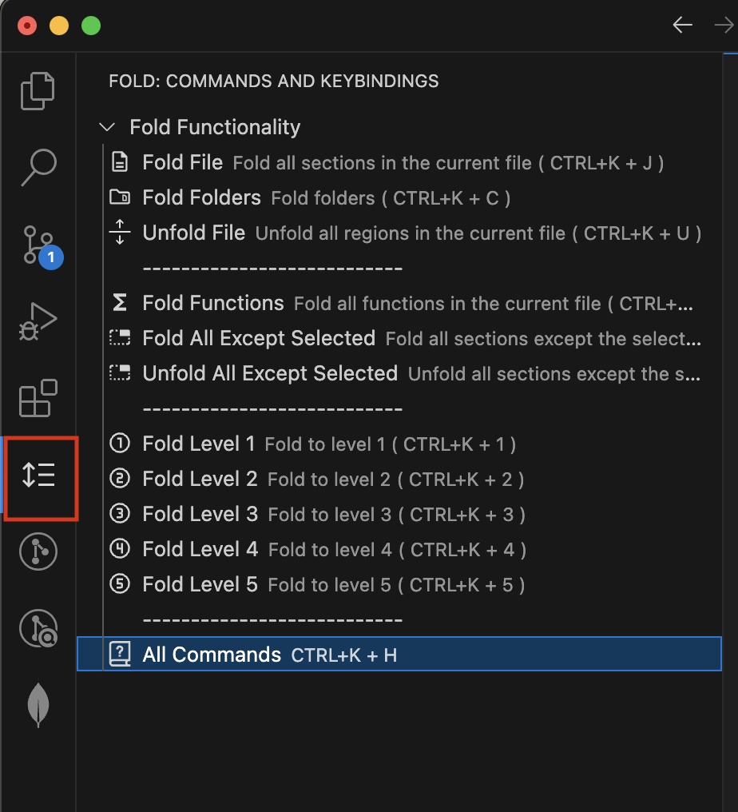
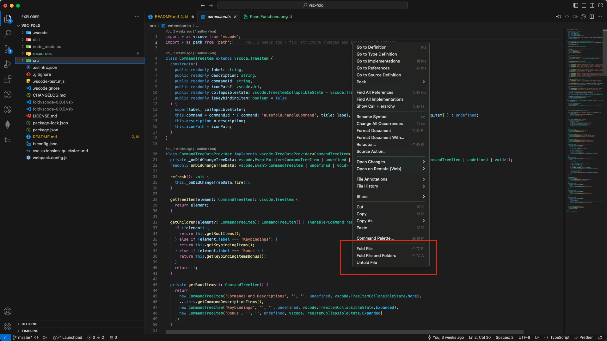

# FoldVSC

[](https://marketplace.visualstudio.com/items?itemName=LeonatKrasniqi.foldvscode)
[](https://marketplace.visualstudio.com/items?itemName=LeonatKrasniqi.foldvscode)
[](https://marketplace.visualstudio.com/items?itemName=LeonatKrasniqi.foldvscode)

A Visual Studio Code extension to efficiently manage folding and more.

## Features

- **Fold Functions**: Fold all function blocks in the current file.
- **Fold File**: Fold all sections in the current file.
- **Fold Everything**: Fold all foldable regions and folders.
- **Unfold Everything**: Unfold all regions and folders.
- **Fold All Except Selected**: Fold all sections except the currently selected one.
- **Unfold All Except Selected**: Unfold all sections except the currently selected one.
- **Fold Level 1-5**: Fold to specified levels, typically used for different levels of code nesting.

### Side Panel Functions


### Right Click Functions



## Installation

1. Open Visual Studio Code.
2. Go to the Extensions view by clicking on the Extensions icon in the Activity Bar on the side of the window.
3. Search for `Fold VSCode`.
4. Click the Install button.

Or install via the command line:

```sh
code --install-extension LeonatKrasniqi.foldvscode
```

### Default Keybindings

| Command                    | Keybinding          |
|----------------------------|---------------------|
| Fold Functions             | `Ctrl+Alt+F`        |
| Fold File                  | `Ctrl+Alt+Shift+F`  |
| Fold Everything            | `Ctrl+Alt+A`        |
| Unfold Everything          | `Ctrl+Alt+Shift+A`  |
| Fold All Except Selected   | `Ctrl+Alt+E`        |
| Unfold All Except Selected | `Ctrl+Alt+Shift+E`  |
| Fold Level 1               | `Ctrl+Alt+1`        |
| Fold Level 2               | `Ctrl+Alt+2`        |
| Fold Level 3               | `Ctrl+Alt+3`        |
| Fold Level 4               | `Ctrl+Alt+4`        |
| Fold Level 5               | `Ctrl+Alt+5`        |
