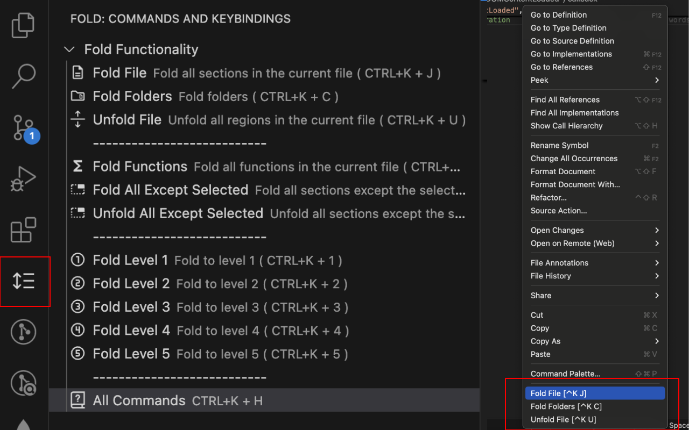

# FoldVSC

[](https://marketplace.visualstudio.com/items?itemName=LeonatKrasniqi.foldvscode)
[](https://marketplace.visualstudio.com/items?itemName=LeonatKrasniqi.foldvscode)
[](https://marketplace.visualstudio.com/items?itemName=LeonatKrasniqi.foldvscode)

A Visual Studio Code extension to efficiently manage folding and more.

## Features
- **Fold File**: Fold all sections in the current file.
- **Fold Folders**: Fold folders.
- **Unfold File**: Unfold all regions in the current file.
- **Fold Functions**: Fold all function blocks in the current file.
- **Fold All Except Selected**: Fold all sections except the currently selected one.
- **Unfold All Except Selected**: Unfold all sections except the currently selected one.
- **Fold Level 1-5**: Fold to specified levels, typically used for different levels of code nesting.
- **Show Commands**: Access a menu of all folding commands.

### Main Image


### Side Panel Functions


### Right Click Functions


### Quick Show All Commands Functions (CTRL+K + H)


## Installation

1. Open Visual Studio Code.
2. Go to the Extensions view by clicking on the Extensions icon in the Activity Bar on the side of the window.
3. Search for `Fold VSCode`.
4. Click the Install button.

Or install via the command line:

```sh
code --install-extension LeonatKrasniqi.foldvscode
```

### Default Keybindings

| Command                    | Keybinding          |
|----------------------------|---------------------|
| Fold File                  | `Ctrl+K J`          |
| Fold Folders               | `Ctrl+K C`          |
| Unfold File                | `Ctrl+K U`          |
| Fold Functions             | `Ctrl+K B`          |
| Fold All Except Selected   | `Ctrl+K + Ctrl+F`   |
| Unfold All Except Selected | `Ctrl+K + Ctrl+U`   |
| Fold Level 1               | `Ctrl+K 1`          |
| Fold Level 2               | `Ctrl+K 2`          |
| Fold Level 3               | `Ctrl+K 3`          |
| Fold Level 4               | `Ctrl+K 4`          |
| Fold Level 5               | `Ctrl+K 5`          |
| Show Commands              | `Ctrl+K Ctrl+H`     |
